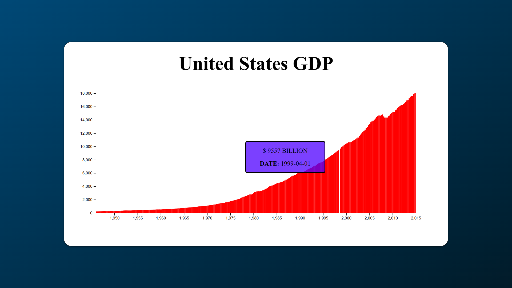

<div align="center">

  
  <br/>

</div>

<!-- TABLE OF CONTENTS -->

# 📗 Table of Contents

- [📖 About the Project](#about-project)
  - [🛠 Built With](#built-with)
    - [Tech Stack](#tech-stack)
    - [Key Features](#key-features)
  - [🚀 Live Demo](#live-demo)
- [💻 Getting Started](#getting-started)
  - [Prerequisites](#prerequisites)
  - [Setup](#setup)
  - [Install](#install)
  - [Usage](#usage)
  - [Run tests](#run-tests)
  - [Deployment](#deployment)
- [👥 Authors](#authors)
- [🔭 Future Features](#future-features)
- [🤝 Contributing](#contributing)
- [⭐️ Show your support](#support)
- [🙏 Acknowledgements](#acknowledgements)
- [❓ FAQ (OPTIONAL)](#faq)
- [📝 License](#license)


# 📖 [UNITED STATES GDP] <a name="about-project"></a>

**[UNITED STATES GDP]** This GitHub project is a data visualization tool that displays the Gross Domestic Product (GDP) data of various countries over a specific time period. The project fetches the GDP data from a JSON file hosted on freeCodeCamp's GitHub repository.

The visualization is implemented using D3.js, a powerful JavaScript library for creating interactive data visualizations in web browsers. The chart is rendered as an SVG (Scalable Vector Graphics) element within the HTML page.

<div align="center">

  
  <br/>

</div>

## 🛠 Built With <a name="built-with"></a>

### Tech Stack <a name="tech-stack"></a>

> Describe the tech stack and include only the relevant sections that apply to your project.

<details>
  <summary>Library</summary>
  <ul>
    <li><a href="https://reactjs.org/">D3.js</a></li>
  </ul>
</details>

<details>
  <summary>Server</summary>
  <ul>
    <li><a href="https://expressjs.com/">javascript</a></li>
  </ul>
</details>


<!-- Features -->

### Key Features <a name="key-features"></a>

- Data Fetching: The project uses the fetch API to asynchronously retrieve the GDP data from the provided JSON file.

- Data Transformation: The fetched data is processed and transformed to extract the necessary information, such as the GDP values and corresponding dates. The toYear function converts the date strings to year values.

- Scaling: The d3.scaleLinear function is used to create linear scales for both the x and y axes. These scales map the input domain (minimum and maximum values from the data) to the output range (dimensions of the chart).

<p align="right">(<a href="#readme-top">back to top</a>)</p>

<!-- LIVE DEMO -->

## 🚀 Live Demo <a name="live-demo"></a>

- [Live Demo Link](https://carreraprogrammer.github.io/Us-GDP/)

<p align="right">(<a href="#readme-top">back to top</a>)</p>

<!-- GETTING STARTED -->

## 💻 Getting Started <a name="getting-started"></a>

To get a local copy up and running, follow these steps.

### Prerequisites

In order to run this project you need:

<!--
Example command:

```sh
 gem install rails
```
 -->

### Setup

Clone this repository to your desired folder:

<!--
Example commands:

```sh
  cd my-folder
  git clone git@github.com:myaccount/my-project.git
```
--->

### Install

Install this project with:

<!--
Example command:

```sh
  cd my-project
  gem install
```
--->

### Usage

To run the project, execute the following command:

<!--
Example command:

```sh
  rails server
```
--->

### Run tests

To run tests, run the following command:

<!--
Example command:

```sh
  bin/rails test test/models/article_test.rb
```
--->

### Deployment

You can deploy this project using:

<!--
Example:

```sh

```
 -->

<p align="right">(<a href="#readme-top">back to top</a>)</p>

<!-- AUTHORS -->

## 👥 Authors <a name="authors"></a>

> Mention all of the collaborators of this project.

👤 **Daniel Carrera**

- GitHub: [@carreraprogrammer](https://github.com/carreraprogrammer )
- Twitter: [@carreraprog](https://twitter.com/carreraprog)
- LinkedIn: [LinkedIn](https://www.linkedin.com/in/daniel-carrera-85a917244/)

<p align="right">(<a href="#readme-top">back to top</a>)</p>

<!-- FUTURE FEATURES -->

## 🔭 Future Features <a name="future-features"></a>

- Data Fetching: The project uses the fetch API to asynchronously retrieve the GDP data from the provided JSON file.

- Data Transformation: The fetched data is processed and transformed to extract the necessary information, such as the GDP values and corresponding dates. The toYear function converts the date strings to year values.

- Scaling: The d3.scaleLinear function is used to create linear scales for both the x and y axes. These scales map the input domain (minimum and maximum values from the data) to the output range (dimensions of the chart).

- Chart Rendering: The SVG element is created and appended to the designated container in the HTML. Rectangular bars representing each data point are drawn using the rect elements. The height of each bar corresponds to the GDP value, and the x-coordinate is calculated based on the year using the xScale.

- Data Labels: Additional information is displayed for each bar using the foreignObject elements. These elements contain HTML content, including the GDP value in billions and the corresponding date. Styling is applied to achieve a consistent appearance.

- Interactive Features: The project enables interactivity by associating each bar with a corresponding data label. When hovering over a bar, the associated data label is displayed, providing more detailed information. This feature is implemented using event listeners and CSS classes.

- Axis Creation: The x and y axes are created using the axisBottom and axisLeft functions from D3.js. The axes are appended to the SVG element, and appropriate transformations are applied to position them correctly.


<p align="right">(<a href="#readme-top">back to top</a>)</p>

<!-- CONTRIBUTING -->

## 🤝 Contributing <a name="contributing"></a>

Contributions, issues, and feature requests are welcome!

Feel free to check the [issues page](../../issues/).

<p align="right">(<a href="#readme-top">back to top</a>)</p>

<!-- SUPPORT -->

## ⭐️ Show your support <a name="support"></a>

> Write a message to encourage readers to support your project

If you like this project...

<p align="right">(<a href="#readme-top">back to top</a>)</p>

<!-- ACKNOWLEDGEMENTS -->

## 🙏 Acknowledgments <a name="acknowledgements"></a>

I would like to thank...

<p align="right">(<a href="#readme-top">back to top</a>)</p>


<!-- LICENSE -->

## 📝 License <a name="license"></a>

This project is [MIT](./LICENSE) licensed.

_NOTE: we recommend using the [MIT license](https://choosealicense.com/licenses/mit/) - you can set it up quickly by [using templates available on GitHub](https://docs.github.com/en/communities/setting-up-your-project-for-healthy-contributions/adding-a-license-to-a-repository). You can also use [any other license](https://choosealicense.com/licenses/) if you wish._

<p align="right">(<a href="#readme-top">back to top</a>)</p>
